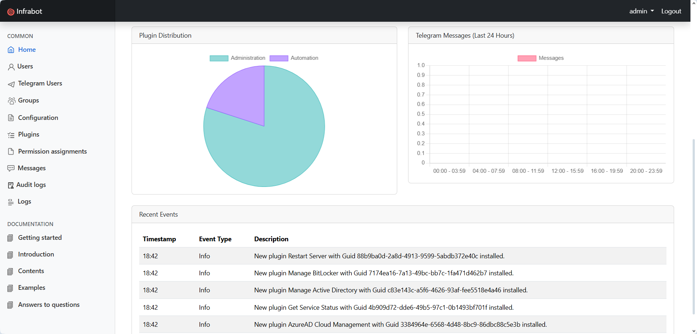

<div align="center">

#  **Infrabot** – Control Your Infrastructure From Telegram

[](https://github.com/infrabot-io/infrabot)


</div>

---

## 🧠 What is Infrabot?

**Infrabot** is a powerful **on-premise automation platform** designed for DevOps, SREs, sysadmins, and infrastructure engineers who want instant, secure command execution **directly from Telegram**.

Build your own modular **commandlets**, extend functionality with **plugins**, and manage your infrastructure with just a message. All without exposing your systems to the cloud.

> ⚡️ Your infrastructure, your rules — now in your pocket.

---

## 👀 Live Demo

<div align="center">
  
</div>




---

## 📦 Features

- Runs as a secure Windows service
- Fully modular architecture — add/remove features with plugins
- Command & control through Telegram
- Encrypted configuration and storage
- Easy-to-create plugins using C#
- Built-in plugin manager, service control, and configuration tooling
- No third-party cloud required
- Comes with examples

---

## 🛠️ Installation Guide

**Automatic**
1. Download the latest [release](https://github.com/infrabot-io/infrabot/releases) and follow the installation process to set up infrabot on your system
2. Open [https://localhost](https://localhost) and login into the system. Default credentials:
```
Login : admin
Password : password
```
3. Review Getting Started page which can be accessed via left side menu

**Manual**
1. Install the latest [ASP.NET Core Runtime 8](https://dotnet.microsoft.com/en-us/download/dotnet/8.0)
1. Install the latest [.NET Desktop Runtime 8](https://dotnet.microsoft.com/en-us/download/dotnet/8.0)
2. Download the latest ZIP release from the [Releases Page](https://github.com/infrabot-io/infrabot/releases)
3. Unpack files into the folder
4. Open CMD and configure services using NSSM which comes with the ZIP archive
```
cd "C:\your\folder\infrabot\nssm-2.24\win64"

nssm.exe install InfrabotWebUI "C:\your\folder\infrabot\WebUI\Infrabot.WebUI.exe"
nssm.exe set InfrabotWebUI AppDirectory "C:\your\folder\infrabot\WebUI"

nssm.exe install InfrabotTelegramService "C:\your\folder\infrabot\TelegramService\Infrabot.TelegramService.exe"
nssm.exe set InfrabotTelegramService AppDirectory "C:\your\folder\infrabot\TelegramService"

nssm.exe install InfrabotWorkerService "C:\your\folder\infrabot\WorkerService\Infrabot.WorkerService.exe"
nssm.exe set InfrabotWorkerService AppDirectory "C:\your\folder\infrabot\WorkerService"
```
5. Launch the ***InfrabotWebUI*** and ***InfrabotWorkerService*** services, and open [https://localhost](https://localhost) to login into the system using default credentials:
```
Login : admin
Password : password
```
6. Configure ***Telegram Bot Token*** on the Configuration page. If you do not know how to get Telegram Bot Token, review Getting Started page on the left side menu. 
7. Launch ***InfrabotTelegramService*** service

_Need help setting it up? Scroll down to the docs section!_

---

## 📚 Documentation

Everything you need to get up and running with Infrabot:

📘 **Essentials**
- [Getting Started](https://infrabot-io.github.io/documentation/gettingstarted.html)
- [Create a Telegram Bot](https://infrabot-io.github.io/documentation/createbot.html)
- [Configuration Overview](https://infrabot-io.github.io/documentation/configoverview.html)

🧠 **Deep Dives**
- [Plugin System](https://infrabot-io.github.io/documentation/pluginoverview.html)
- [Service Behavior](https://infrabot-io.github.io/documentation/infrabotservice.html)
- [Example Scripts](https://infrabot-io.github.io/documentation/examplescripts.html)

---

## 📏 Scheme

Scheme of infrabot components is specified below.


---

## 🔌 Plugin System

Infrabot is built to be extended.

🧠 Want to automate server reboots? Query databases? Deploy services? Just write a plugin.

> 📂 `.plug` files are compiled, serialized via Protocol Buffers, and live independently of the core app.
 
Each plugin defines the commandlets Infrabot can execute — and you can include multiple commands in one plugin.

📎 Check out the [Example Plugins](https://infrabot-io.github.io/documentation/examplescripts.html) to get started.

<details>
<summary><strong>📦 Plugin Basics</strong></summary>

- Format: Only `.plug` files are recognized
- Unique GUID & Plugin ID assigned at creation
- Commands with the same name across plugins are supported — just use the plugin ID to specify which one to run
- Created/modified using the **Plugin Editor**
- Contains metadata + scripts/apps needed for execution
- Each plugin can define **multiple commandlets**

</details>

<details>
<summary><strong>🚀 Installing Plugins</strong></summary>

- Copy the `.plug` file to `/plugins` in the Infrabot Telegram Service directory  
- Infrabot auto-detects and extracts contents into `/plugins/{plugin-GUID}`  
- If a newer version exists, it will **replace the old one**  
- Plugin appears automatically on the **Plugins** web page  
- Optionally use `/reloadplugins` to force immediate plugin reload  

</details>

<details>
<summary><strong>🗑️ Plugin Removal</strong></summary>

- Deleting the `.plug` file removes plugin
- Extracted plugin folder remains unless deleted manually  
- If redeployed, the folder is **replaced and re-extracted** automatically  

</details>

<details>
<summary><strong>🔐 Integrity & Execution</strong></summary>

- Executables can reside in subdirectories within the plugin folder  
- Use correct relative paths in the plugin configuration  
- File hashes are checked before each execution  
- If a mismatch is found, execution is **blocked** to prevent tampering  

</details>

<details>
<summary><strong>🔄 Command Updates & Conflicts</strong></summary>

- Telegram command menu updates within **3–5 minutes**  
- Use plugin IDs to disambiguate overlapping command names  
- Duplicate entries?  
  → Delete the `.plug` file → wait for cleanup → redeploy cleanly  

</details>

---

## 🧱 Building from Source

Want to customize or contribute?

1. Install **Visual Studio 2022**
2. Open the solution file
3. Build the project (Debug or Release mode)

That's it — you're ready to roll.

---

## 🤝 Contribute

We love community contributions! Here's how you can help:

- Report bugs and open issues
- Add new functionality
- Develop new plugins
- Improve the documentation

Every PR is appreciated. Let's build something epic together.

<div align="center">
  
</div>
